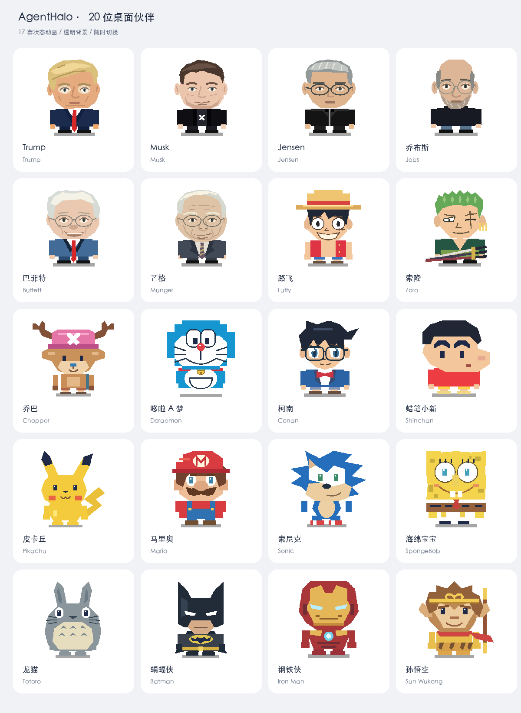

# AgentHalo

一个安静的桌面伙伴，跟着你的 AI 任务状态动：在思考、在调工具、需要你回话、干完了，各有对应的动作和提示音。点一下卡片就能切回对应的窗口或标签页。

状态只有两种颜色：绿色「工作中」，灰色「等待中」。



## 安装

```sh
npx agenthalo
```

会自动识别芯片、下载对应的包、校验后装进 `/Applications` 并打开。需要 macOS 和 Node 18 以上。

也可以到 [Releases](https://github.com/addsumtech/AgentHalo/releases) 手动下载 `.dmg`。手动下载的文件带隔离属性，第一次打开需要在「系统设置 → 隐私与安全性」里允许一次；用 `npx` 安装不会遇到这一步。

装好后到「设置 → 连接应用」，给你实际在用的 AI 工具装上 hook，桌宠才能收到状态。AgentHalo 默认显示 Dock 图标，点击即可打开设置主界面，同时保留菜单栏入口；可在设置中关闭 Dock 图标。

## 能做什么

- **命令行工具**：Claude Code、Codex CLI、ChatGPT App 里的本地 Codex 会话。
- **桌面应用**：WorkBuddy、QwenWork 等原生 hook 接入。
- **浏览器**：Claude、ChatGPT、Gemini 的对话生成状态。点击任务卡片优先切回已有标签页，找不到才新开。
- **20 套角色主题**，设置里随时切换，也可以导入自己做的主题包。
- 五套界面配色，跟随系统深浅模式。
- 桌宠旁显示主任务，后台子任务不单独占位；任务多时可滚动查看。
- 右键桌宠或菜单栏图标可切换大小，设置里还有连续缩放滑块。

## 角色与动画

| 系列 | 角色 |
|---|---|
| 人物 | Trump、Musk、Jensen、乔布斯、巴菲特、芒格 |
| 动漫 | 路飞、索隆、乔巴、哆啦 A 梦、柯南、蜡笔小新、龙猫、海绵宝宝 |
| 游戏与影视 | 皮卡丘、马里奥、索尼克、蝙蝠侠、钢铁侠、孙悟空 |

每套角色有 17 个状态与交互动画：待机、思考、工作、多任务、完成、错误、提醒、睡眠、唤醒、走动，以及点击、双击、拖动。角色在各状态中保持相同坐标和基线，缩放不改变比例。

本地可以打开 [交互预览](docs/previews/companions.html) 查看全部状态。重新生成角色视觉（不覆盖已配好的声音）：

```sh
python3 agenthalo-themes/gen_companions.py
```

设计上参考了 [Codex / ChatGPT Pets](https://learn.chatgpt.com/docs/pets) 的透明角色与任务状态动画思路，本项目沿用可编辑 SVG 与自己的状态机。

## 项目结构

| 目录 | 内容 |
|---|---|
| `agenthalo/` | Electron 桌宠源码、依赖与测试 |
| `agenthalo-installer/` | `npx agenthalo` 安装器 |
| `agenthalo-web-bridge/extension/` | Chrome MV3 扩展 |
| `agenthalo-themes/` | 主题生成脚本与预览工具 |
| `themes/` | 指向 `agenthalo/themes/` 的兼容入口 |

## 开发

需要 Node.js 22.12 或更新版本。

```sh
cd agenthalo
npm ci
npm start
```

启动开发版前先退出正在运行的桌宠。运行测试：

```sh
npm test
```

浏览器扩展在 Chrome 扩展管理页加载 `agenthalo-web-bridge/extension/` 即可。更新扩展后要在扩展页点「重新加载」，再刷新聊天页面。注册方法见 [桥接说明](agenthalo-web-bridge/README.md)。

已知未修复的问题记录在 [OPEN-DEFECTS.md](docs/OPEN-DEFECTS.md)。

## 反馈

问题与建议提交到 [Issues](https://github.com/addsumtech/AgentHalo/issues)。隐私说明见 [PRIVACY.md](docs/PRIVACY.md)，支持方式见 [SUPPORT.md](docs/SUPPORT.md)。

## 致谢与许可证

AgentHalo 基于 [Clawd on Desk](https://github.com/rullerzhou-afk/clawd-on-desk) 开发，感谢原作者 Ruller_Lulu 和全部贡献者。上游版权与许可证均已保留。

AgentHalo 新增代码与原创设计 © 2026 Addsum。项目采用 [AGPL-3.0-only](agenthalo/LICENSE)，第三方素材说明见 [NOTICE.md](agenthalo/NOTICE.md)。
